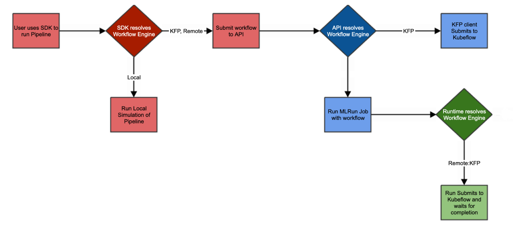

(local-remote)=
# Local vs. remote workflows

To run multiple functions, one after the other, or in parallel, such as: `jobs`, `serving` and `nuclio`, you can use a KFP pipeline. There are three types of pipeline engines:
- [Remote on KFP](#remote-kfp)
- [KFP](#kfp)
- Local &mdash; Used to simulate a pipeline run without using KFP - it triggers the jobs directly, mainly for testing. Use (set `local=True in function.run()` to run the functions locally or `project.run(local=True)` to apply for all functions).



All three types are configured by the `engine` flag, when running the workflow, see {py:class}`mlrun.projects.MlrunProject.run`.

**In this section**
- [Remote on KFP](#remote-kfp)
- [KFP](#kfp)
 
## Remote-KFP 

Remote workflows are run on the workflow runner pod, which runs and loads your workflow on a pod named `workflow-runner-<workflow-name>`. This pod is responsible for loading the files from the remote source (git, tar.gz or zip) and running the KFP by using the files from the remote source.  
In some cases you might not want to load the files from the remote source, but instead use the files within the running image. See details in [build image](../projects/run-build-deploy.md#build_image). In this case, you need to build an image that contains the workflow file and then change the workflow runner source to point to the project local files in the running image. See the example below.

Remote workflows are used for [scheduled workflows](./scheduled-jobs.md#scheduling-a-workflow). Only workflows that use the remote engine can be scheduled. 

The remote workflow supports [sending notifications](./notifications.md#remote-pipeline-notifications) when runs are complete.

You can modify the pod image, source, and the pod node selector with:
- `project.set_workflow(name="main",workflow_path="workflow.py",image="<runner-image>")` &mdash; changing the runner image
- `project.run("main",engine="remote",workflow_runner_node_selector={"key":"value"})` &mdash; changing the runner node selector 
- `project.run(source=<source-URL>)` &mdash; changing the runner source

```{admonition} Note
This pod must be based on the image `mlrun/mlrun-kfp`. See {ref}`images-usage`.
```

See an example of a remote GitHub project in https://github.com/mlrun/project-demo.
```{admonition} Note
From MLRun v1.7.1: when running a remote/scheduled workflow, the remote workflow pulls/extracts the remote source content to the running pod but loads the project configuration from the MLRun DB and not from the project.yaml file in the remote source.

The remote files are primarily retrieved for:
- The [project_setup](../projects/project-setup.md) that may affect the project configuration (if it exists).
- Syncing function files.
This behavior may be unexpected for users who rely on project.yaml in the remote source (for the project configuration).
Be sure to update MLRun DB with the latest project configuration to ensure consistent configuration management (use `project.save()`).<br>
Project configuration in this context could be, for example, `project.node_selector` or `project.artifact_path`, and not function configurations like: function resources or function node selector.
```
```
import mlrun
project_name = "remote-workflow-example"
source_url = "git://github.com/mlrun/project-demo.git"
source_code_target_dir = "./project" # Optional, relative to "/home/mlrun_code". A different absolute path can be specified.

# Create a new project
project = mlrun.load_project(context=f"./{project_name}", url=source_url, name=project_name)

# Set the project source
project.set_source(source_url)

# Build the image based on mlrun-kfp, load the source to the target dir
result = project.build_image(base_image="mlrun/mlrun-kfp" ,target_dir=source_code_target_dir, set_as_default=False)

# Set the workflow and save the project
project.set_workflow(name="main", workflow_path="kflow.py", image=result.outputs["image"])
project.save()

# Run the workflow, load the project from the target dir on the image
project.run("main", source="./", engine="remote", dirty=True)
```

See also 
- [Local and KFP engine pipeline notifications](../concepts/notifications.md#local-and-kfp-engine-pipeline-notifications).

## KFP

The KFP workflow spec file is created in MLRun, and is compiled and run in the client side, using the files from your local file system.
For example:
```
project.run("main", engine='kfp')
```